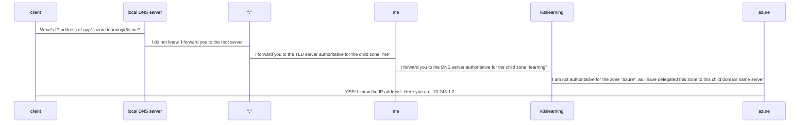
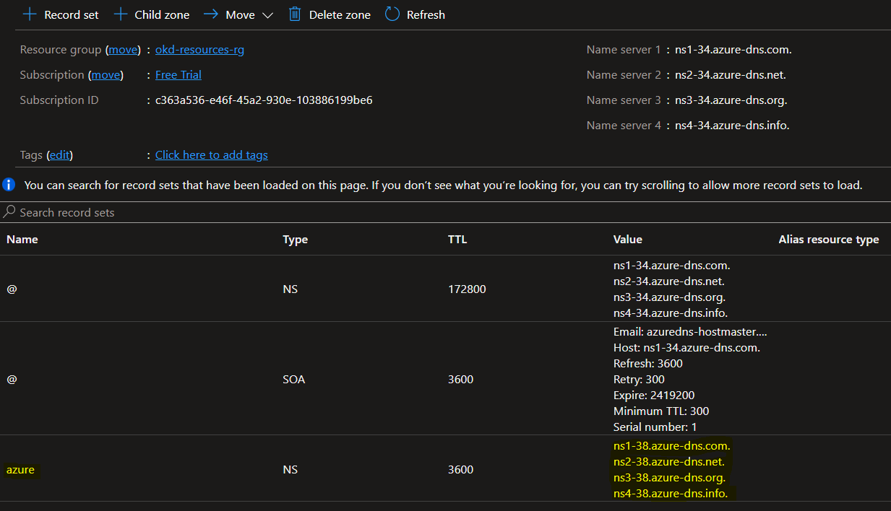

# INSTALL OKD4.9 ON AZURE

Following guide is based on the official [installation procedure](https://docs.okd.io/4.9/installing/installing_azure/preparing-to-install-on-azure.html).

## PREREQUISITE
- read the [core concept](./core-concepts.md) guide
- **An Azure account**: It is possible to create an azure account for **free** with a budget of 200$. Keep in mind that a Azure has by default set some [limits](https://docs.microsoft.com/en-us/azure/azure-resource-manager/management/azure-subscription-service-limits) mostly to prevent unexpteced costs from happening. Those limits, or quotas, can be adjusted **BUT** Free Trial subscriptions aren't eligible for limit or quota increases and that could force us to upgrade to a Pay-As-You-Go subscription. __This is not what I did and rest of the guide will show you how to install a OKD cluster within limits and using a free trial subscription__.
- Keeping in mind what told before, our next challenge is the choice of the installation type. Like said in the [core concept](./core-concepts.md), we will go for the **IPI** method of installation, the one suggested by Red Hat itself, but there are different types of istallation which are possible to execute on Azure:

| Choice | Type | Note  |
|--------|------|-------|
|[ ] |[Default](https://docs.okd.io/4.9/installing/installing_azure/installing-azure-default.html#installing-azure-default)  | This is the quickets way to get a OKD cluster on Azure **BUT** you won't have the possibility to customize you install-config file and that will lead to a cluster that will exceed the Azure limits which are not adjustable if you are using a Free-trial subscription. IPI will fail.|
|[X] |[Custom](https://docs.okd.io/4.9/installing/installing_azure/installing-azure-customizations.html#installing-azure-customizations)  | We need to use a custom install-config in order to create a light-weight cluster in order not to adjust the limits/quotas |
|[ ] |[Network customization](https://docs.okd.io/4.9/installing/installing_azure/installing-azure-network-customizations.html#installing-azure-network-customizations) | This is out-of-scope this exercise|
|[ ] |[Private Cluster](https://docs.okd.io/4.9/installing/installing_azure/installing-azure-private.html#installing-azure-private)| This exercise will deploy a public cluster as it is intended for learning purpose and won't be used for storing sensitive data or running special workloads, so no need to create a private cluster|
|[X] |[Existing VNET](https://docs.okd.io/4.9/installing/installing_azure/installing-azure-vnet.html#installing-azure-vnet)| We go for this option just for the sake of customizing a bit more our installer|

### AZURE ACCOUNT CONFIGURATION
After having chosen the type of installation, we need to [configure our Azure account](https://docs.okd.io/4.9/installing/installing_azure/installing-azure-account.html#installing-azure-account). You do not need to follow the linked guide, just keep reading as I will walk you through the tasks you need to perform for our specific type of installation.

#### CONFIGURING A PUBLIC DNS ZONE IN AZURE
Our cluster will be publicly available over the Internet, therefore to install OKD, the Microsoft Azure account you use must have a dedicated *public hosted DNS zone* in your account. The DNS zone must be authoritative for the domain. This service provides cluster DNS resolution and name lookup for external connections to the cluster.

--------------
Now, before listing the actions we need to perform, a short digression on *name resolution*, a topic which I still do not fully manage on my own. I'll try hereby to explain some core concepts:
- What's the goal: Make use of the Domain Name Service infrastructure built around the world to perform the translation from a human-friendly way of identifying resources, es: www.app1.azure.learningk8s.me, to a machine-friendly way of identifying resources, es: 10.123.1.2.
-  DNS Servers: Are the components of the DNS Infrastructure that either make the translation or forward the requester to the next server of the name resolution chain
-  DNS Domain: vs DNS Zone: Whilst domain is a logical division, a zone is a physical division of the DNS name space. Usually you have a 1:1 relationship between a Domain and its Zone.
- Domain name registar: A company from which you can buy a public domain name it is known, i.e. addressable, from the top level domains (TLD);
- Sub-zone: In DNS Infrastructure, name resolution works hierarchically:
  - . : root domain name
  - me. : top level domain
  - learningk8s.me. :first level domain
  - azure.learningk8s.me. : second level domain (for example, this is a sub-domain (zone) of the level above!)
  - app1.azure.learningk8s.me. : NS record

Every single domain, has it own DNS serve(s) which are **authoritative**, that is, they know how to resolve a specific zone and, when they do not, at least they forward you to DNS Server **delegated** for that domain (zone).
The following sequence diagram try to explain the whole name resolution interaction:

--------------

So, what do we need to do?

 1. We need to have a public domain. If you do not have one, you can purchase a domain for **free** at [register.it](https://www.register.it/)
 2. Now that you have a DNS domain, in my case `learningk8s.me`, you can use Azure DNS to host it and manage your DNS records. That means we use some domain name servers given by Azure and those servers become **authoritative** for the domain we have created in step 1 (following steps are taken from this [tutorial](https://docs.microsoft.com/en-us/azure/dns/dns-delegate-domain-azure-dns):
 3. In order to do so, we need to  create in azure a [parent DNS zone](https://docs.microsoft.com/en-us/azure/dns/dns-delegate-domain-azure-dns#create-a-dns-zone) using the same name you used at the creation of your domain, `learningk8s.me`
 4.  Retrieve the name servers from the DNS zone page
 5. Go the administration console of your registar and configure it to use the Azure DNS name server to resolve names belonging to that domain. In this way, you have delegated Azure to be authoritative over the `learningk8s.me` zone.
 6. As our final goal, is to not build only one k8s cluster, but many, and on different platforms, we need to [create a child zone](https://docs.microsoft.com/en-us/azure/dns/tutorial-public-dns-zones-child#create-child-dns-zone-via-create-dns-zone), azure.learningk8s.me. This zone is the one which will contain our A record belonging to the applications that will run on the cluster.

If you've done everything correct you should see from the portal the following:

As you can see from the picture, from within  `learningk8s.me` overview page, you have the configuration (in yeallow) which says that for everything belonging to the  `azure` subdomain you should go to those delegated name server, the one which contain the A record for the name of our (future) applications.

https://docs.okd.io/4.9/installing/installing_azure/installing-azure-customizations.html
