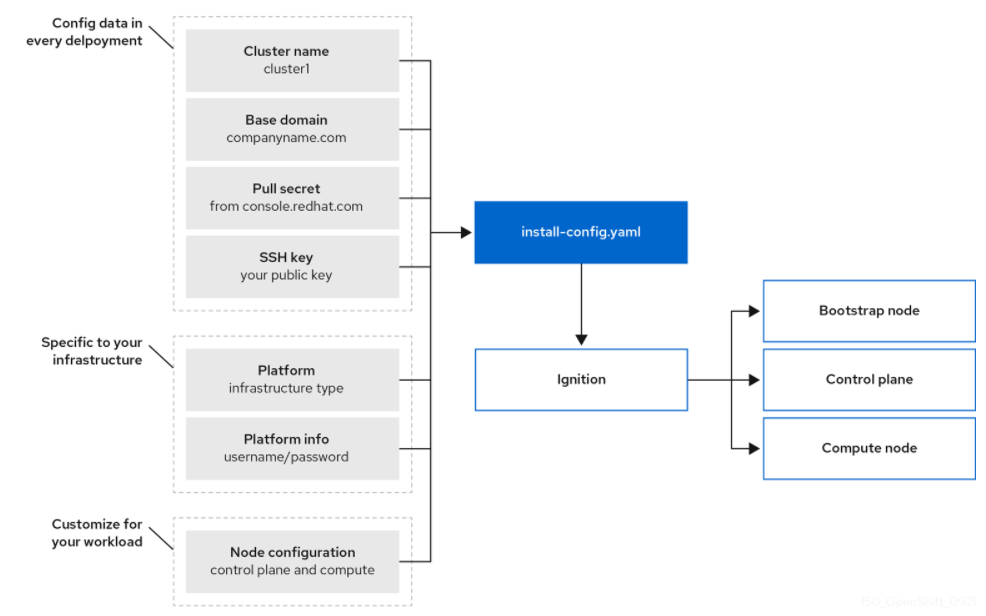
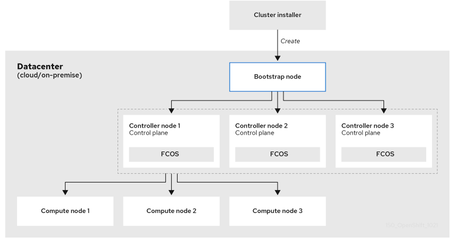

# OKD OVERVIEW

In this file we are going to make clear some concepts that are key to the OKD installation process and may not be known to people, like myself, who are approaching for the first time the installation of a container platform.

Information will follow are based on the OKD 4.9 version.

## INSTALLATION DIAGRAM (HIGH-LEVEL)

The picture above represents a subset of the installation targets and dependencies.
Let's talk about some objects which are key to the OKD installation:
- **install-config.yaml**: This is the file in which you design your future cluster. Choices made now have impacts on the cluster that will be installed later. Once this file is ready, it'll be taken in input by the OKD installer.
- **Fedora CoreOS (FCOS)**: minimal operating system optimized for running containerized workloads securely and at scale. Fedora CoreOS does not have a separate install disk. Instead, every instance starts from a generic disk image which is customized on first boot via Ignition. The FCOS image is retrieved at runtime during installation (NOTE: This is IPI, with UPI process is different). Key FCOS features:
  - Controlled immutability:  FCOS is designed to be managed more tightly than a default RHEL installation. Management is performed remotely from the OpenShift Container Platform cluster.
  - CRI-O container runtime: FCOS incorporates the CRI-O container engine instead of the Docker container engine.
  - auto-update: Operating system updates are delivered as an Atomic OSTree repository that is embedded in a container image that is rolled out across the cluster by an Operator.
- **ignition**: Ignition is a provisioning utility used by Fedora CoreOS and RHEL CoreOS that reads a configuration file (in JSON format) and provisions a Fedora CoreOS (or RHEL CoreOS) based on that configuration. This utility runs only once during the first boot of the system (while in the initramfs), and thanks for running so early in the boot process it can re-partition disks, format filesystems, create users, and write files before the userspace begins to boot, and it does everything based on the configuration described in the ignition file.
- **ignition file**: JSON file, produced by the install-config.yaml. Once you have an Ignition (.ign) file, you can use it to boot an FCOS system in a VM or install it on bare metal. In our case, we'll have the ingnition config files for the following machines:
  - bootstrap: This is a temporary VM that is used to create networking, machines, and operating systems that are required to support the cluster.
  - master: A master node is a node which controls and manages a set of worker nodes (workloads runtime) and resembles a cluster in Kubernetes
  - worker: The nodes which host the workloads
The installation configuration file is transformed into Kubernetes manifests, and then the manifests are wrapped into Ignition config files. The installation program uses these Ignition config files to create the cluster.

## INSTALLATION PROCESS
You can install a OKD cluster into two different ways:
- For clusters with **installer-provisioned infrastructure (IPI)**, you delegate the infrastructure bootstrapping and provisioning to the installation program instead of doing it yourself. The installation program creates all of the networking, machines, and operating systems that are required to support the cluster.
- If you provision and manage the infrastructure for your cluster, **user-provisioned infrastructure (UPI)**, you must provide all of the cluster infrastructure and resources, including the bootstrap machine, networking, load balancing, storage, and individual cluster machines.

For this journey, we'll use the IPI style of installation.

### INSTALLATION DETAILS
Because each machine in the cluster requires information about the cluster when it is provisioned, OKD uses a temporary bootstrap machine during initial configuration to provide the required information to the permanent control plane. It boots by using an Ignition config file that describes how to create the cluster. The bootstrap machine creates the control plane machines that make up the control plane. The control plane machines then create the compute machines, which are also known as worker machines.  

After the cluster machines initialize, the bootstrap machine is destroyed.  
The result of this bootstrapping process is a fully running OKD cluster. The cluster then downloads and configures remaining components needed for the day-to-day operation, including the creation of compute machines in supported environments.

## USEFUL LINKS
- [OKD4.9-installation-overview](https://docs.okd.io/4.9/architecture/architecture-installation.html)
- [ignition](https://coreos.github.io/ignition/)
- [fedora-coreos](https://docs.fedoraproject.org/en-US/fedora-coreos/producing-ign/)

